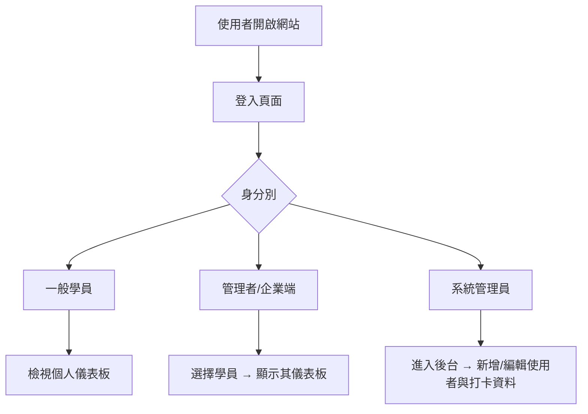
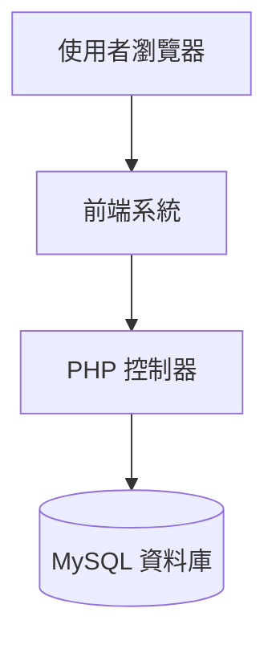

# 📘 團體專案 – 出缺勤系統
## 🧭 系統流程圖

## 🏗️ 系統架構圖

📦 資料表結構
###  課程資料 – `classes`

| 欄位名稱     | 資料型別 | 說明     |
|--------------|----------|----------|
| id           | INT      | 主鍵     |
| group_name   | VARCHAR  | 班級     |
| class_date   | DATE     | 上課日期  |
| class_hours  | INT      | 課程時數  |
| class_name   | VARCHAR  | 課程名稱  |

###  打卡記錄原始檔 – `total_hours`

| 欄位名稱   | 資料型別 | 說明           |
|------------|----------|----------------|
| group_name | VARCHAR  | 班級            |
| Name       | VARCHAR  | 學員姓名         |
| In/Out     | VARCHAR  | 打卡狀態(in/out) |
| Time       | VARCHAR  | 打卡時間         |
| Date       | VARCHAR  | 打卡日期         |
|IPAddress   | VARCHAR  | 打卡IP          |
### 使用者 - `admin_users`
| 欄位名稱     | 資料型別 | 說明     |
|--------------|----------|----------|
| no           | INT      | 主鍵     |
| acc   | VARCHAR         | 帳號     |
| pwd   | VARCHAR         | 密碼  |
| role  | enum('admin', 'adv-user', 'normal-user')| 用來限制使用者權限  |
###  出缺席紀錄原始檔 – `attendance_log`

| 欄位名稱        | 資料型別 | 說明           |
|------------     |---------|----------------|
| id              | INT     | 主鍵           |
| name            | VARCHAR | 學員姓名        |
| class_date      | date    | 上課日期        |
| class_hours     | float   | 課程時數        |
| raw_hours       | float   | 在校時間        |
| attended_hours  | float   | 上課時數        |
| late_hours      | float   | 遲到時數        |
| leave_early_hours| float  | 早退時數        |
| absent_hours    | float   | 未到時數        |

### 👥 工作分工

| 姓名 | 角色           | 負責項目                                | 狀態                         |
|------|----------------|-----------------------------------------|------------------------------|
| 小明 | 後端工程師     | 載入資料庫資料、登入驗證、後台打卡管理 | ☐ 未開始 ☐ 進行中 ☐ 完成    |
| 小美 | 前端工程師     | 儀表板頁面、圖表製作、AJAX 串接         | ☐ 未開始 ☐ 進行中 ☐ 完成    |
| 小華 | 文件／架構設計 | HackMD 報告、流程圖／架構圖、資料庫設計整理 | ☐ 未開始 ☐ 進行中 ☐ 完成 |
