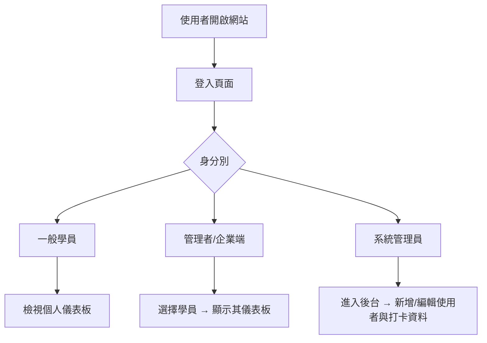
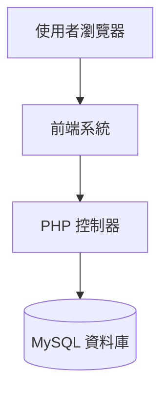

# 📘 團體專案 – 出缺勤系統

## 🧭 系統流程圖



## 🏗️ 系統架構圖



## 🚀 快速開始

### 1. 克隆專案

```bash
git clone [專案網址]
cd attendance_website
```

### 2. 安裝 PHP 依賴

```bash
composer install
```

### 3. Docker 環境建立

#### 3.1 docker建立資料庫

同時設定密碼

```bash
docker run -itd --name mysql -p 3306:3306 -e MYSQL_ROOT_PASSWORD=ashen2250 mysql
```

```bash
docker run --name phpmyadmin -d --link mysql -e PMA_HOST="mysql" -p 8080:80 phpmyadmin/phpmyadmin 
```

#### 3.3 docker建立 php/apache

```bash
docker build -t myattendance-phpapache . 
#將專案資料夾打包成映像檔
```

啟用容器並將資料夾映射到容器

```bash
# Mac 用戶請使用以下路徑
docker run -d --name running-attendence -p 80:80 -v /Users/你的用戶名/專案資料夾:/var/www/html/ myattendance-phpapache:latest

# Windows 用戶請使用以下路徑
docker run -d --name running-attendence -p 80:80 -v /豬案資料夾:/var/www/html/ myattendance-phpapache:latest
```

### 4. 初始化資料庫

- 開啟 phpMyAdmin：<http://localhost:8080>
- 匯入 `database/` 資料夾中的 SQL 檔案

### 5. 設定資料庫連線

更新 `inc/db.inc.php` 中的連線資訊

### 6. 啟動服務

```bash
# 方法1：使用 Docker
http://localhost

# 方法2：使用 PHP 內建伺服器
cd public && php -S localhost:8000
```

## 📁 專案結構

```bash
attendance_website/
├── 📁 database/          # 資料庫相關檔案
│   ├── *.sql            # 資料表結構檔
│   └── 用docker建立環境語法.txt
├── 📁 inc/              # 核心功能檔案
│   ├── db.inc.php       # 資料庫連線設定
│   └── twig.inc.php     # Twig 模板引擎設定
├── 📁 public/           # 公開存取檔案
│   ├── login.php        # 登入頁面
│   ├── *_dashboard.php  # 各角色儀表板
│   └── *.json          # AJAX 資料檔
├── 📁 templates/        # Twig 模板檔案
├── 📁 vendor/           # Composer 套件
├── composer.json        # PHP 套件管理
├── Dockerfile          # Docker 映像檔設定
└── README.md           # 專案說明文件
```

## 📦 資料表結構

### 表1. 課程資料 – `classes`

| 欄位名稱     | 資料型別 | 說明     |
|--------------|----------|----------|
| id           | INT      | 主鍵     |
| group_name   | VARCHAR  | 班級     |
| class_date   | DATE     | 上課日期  |
| class_hours  | INT      | 課程時數  |
| class_name   | VARCHAR  | 課程名稱  |

### 表2. 打卡記錄原始檔 – `total_hours`

| 欄位名稱   | 資料型別 | 說明           |
|------------|----------|----------------|
| group_name | VARCHAR  | 班級            |
| Name       | VARCHAR  | 學員姓名         |
| In/Out     | VARCHAR  | 打卡狀態(in/out) |
| Time       | VARCHAR  | 打卡時間         |
| Date       | VARCHAR  | 打卡日期         |
|IPAddress   | VARCHAR  | 打卡IP          |

### 表3. 使用者 - `admin_users`

| 欄位名稱     | 資料型別 | 說明     |
|--------------|----------|----------|
| no           | INT      | 主鍵     |
| acc   | VARCHAR         | 帳號     |
| pwd   | VARCHAR         | 密碼  |
| role  | enum('admin', 'adv-user', 'normal-user')| 用來限制使用者權限  |

### 表4. 出缺席紀錄原始檔 – `attendance_log`

| 欄位名稱        | 資料型別 | 說明           |
|------------     |---------|----------------|
| id              | INT     | 主鍵           |
| name            | VARCHAR | 學員姓名        |
| class_date      | date    | 上課日期        |
| class_hours     | float   | 課程時數        |
| raw_hours       | float   | 在校時間        |
| attended_hours  | float   | 上課時數        |
| late_hours      | float   | 遲到時數        |
| leave_early_hours| float  | 早退時數        |
| absent_hours    | float   | 未到時數        |

## 👤 預設帳號

| 角色 | 帳號 | 密碼 | 說明 |
|------|------|------|------|
| 系統管理員 | <admin@test.com> | password | 完整後台權限 |
| 企業管理者 | <adv-user@test.com> | password | 查看所有學員資料 |
| 一般學員 | <user@test.com> | password | 僅查看個人資料 |

> ⚠️ 注意：正式環境請務必修改預設密碼！

## 🛠️ 技術堆疊

- **後端**：PHP 8.x
- **前端**：Bootstrap 5, Chart.js, jQuery
- **模板引擎**：Twig
- **資料庫**：MySQL 8.x
- **容器化**：Docker
- **套件管理**：Composer

## 🚨 常見問題與解決方案

### ❗ 環境問題排查

#### 1. Docker 容器狀態檢查

```bash
# 檢查所有容器狀態
docker ps -a

# 檢查容器日誌
docker logs mysql
docker logs phpmyadmin
docker logs running-attendence
```

#### 2. 資料庫連線問題

- **問題**：無法連接到 MySQL 資料庫
- **解決**：
  1. 確認 Docker 容器 IP：`docker inspect mysql | grep IPAddress`
  2. 更新 `inc/db.inc.php` 中的主機位址
  3. 檢查防火牆設定

#### 3. Apache 容器 80 Port 找不到檔案

- **問題**：訪問 <http://localhost> 顯示 "Not Found"
- **解決**：
  1. 檢查檔案掛載路徑是否正確（Mac 用戶注意路徑格式）
  2. 確認 Dockerfile 設定正確
  3. 重新建置映像檔：`docker build -t myattendance-phpapache .`

#### 4. Twig 模板錯誤

- **問題**：`Class "Twig\Cache\NullCache" not found`
- **解決**：

  ```bash
  composer install
  composer update twig/twig
  ```

#### 5. PHP 環境檢查

```bash
# 檢查 PHP 版本
php -v

# 檢查必要擴展
php -m | grep pdo
php -m | grep mysql
```

### 🔧 開發環境設定

#### VS Code 建議擴展

- Twig Language 2
- Live Server
- Docker
- GitLens

#### 本地測試伺服器

```bash
# 使用 PHP 內建伺服器
php -S localhost:8000

# Twig 模板測試
# 訪問 http://localhost:8000/twig_test.php
```

## 🐛 已知問題與改進計畫

### 🚧 開發中功能

- [ ] 密碼加密（目前為明文儲存）
- [ ] 資料匯出功能（CSV、PDF）
- [ ] 即時通知系統
- [ ] 手機版 RWD 優化

### 🔒 安全改進

- [ ] SQL 注入防護加強
- [ ] XSS 防護
- [ ] CSRF Token
- [ ] 密碼強度檢驗

### ⚡ 效能優化

- [ ] 資料庫查詢優化
- [ ] 圖表載入優化
- [ ] 快取機制實作

### 👥 工作分工

| 姓名 |  負責項目                 | 狀態            |
|------|-----------------------------------------|------------------------------|
| Shen | 儀錶板頁面、打卡紀錄頁面、Docker Image、 HackMD 流程／架構圖、資料庫設計整理| ☐ 未開始 ☑️ 進行中 ☐ 完成    |
| Cody |  新增使用者頁面、AJAX 串接  HackMD 技術統整、版本歷程、問題提出及排解      | ☐ 未開始 ☑️ 進行中 ☐ 完成    |
| KevinLiu | 一般權限頁面建構、企業端使用者頁面建構、AJAX 串接 | ☐ 未開始 ☑️ 進行中 ☐ 完成 |

## 🔗 相關連結

- [Twig 官方文件](https://twig.symfony.com/doc/)
- [Chart.js 文件](https://www.chartjs.org/docs/)
- [Bootstrap 5 文件](https://getbootstrap.com/docs/5.0/)
- [Docker 官方文件](https://docs.docker.com/)

## 📝 版本歷程

- v1.0.0 (2025-01-XX) - 初版發布
  - 基本登入功能
  - 儀表板顯示
  - Docker 環境建置
  - Twig 模板系統

### 🛠️技術堆疊

- **後端**：PHP 8.x
- **前端**：Bootstrap 5, Chart.js, jQuery
- **模板引擎**：Twig
- **資料庫**：MySQL 8.x
- **容器化**：Docker
- **套件管理**：Composer
